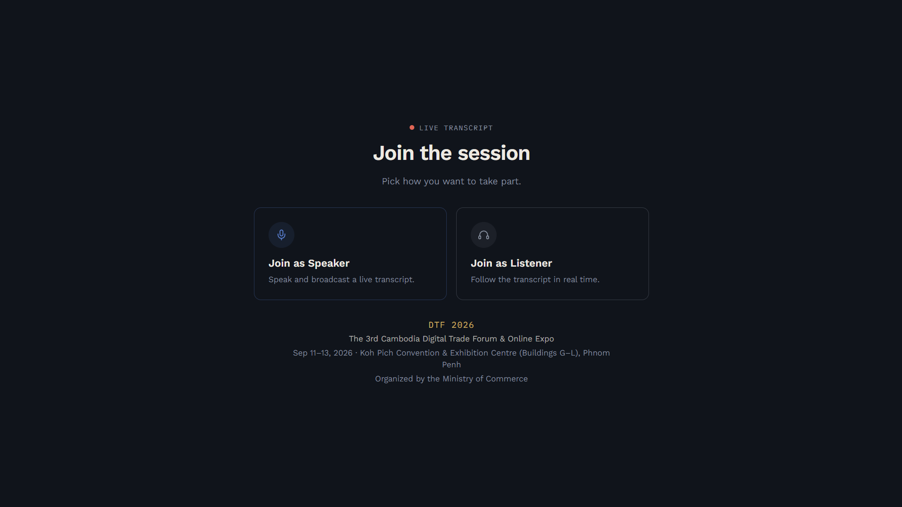
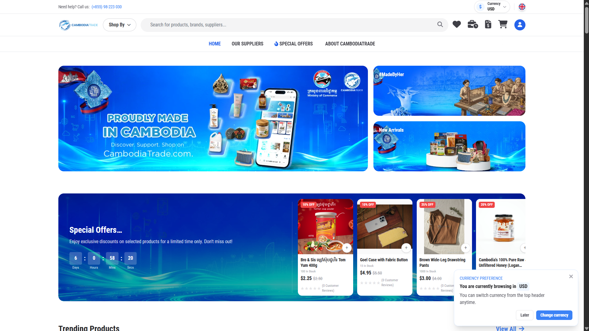

<!-- =======================================================
     VIPHOU SARUN — GITHUB PROFILE
     ======================================================= -->

  

# Hey! Welcome to my profile. 👋

I'm **Viphou**, a software engineer and product builder from Phnom Penh, Cambodia.

I lean into first-principles thinking to build products that solve actual problems. Currently, I'm developing Hybrid RAG systems as an IT Officer at Cambodia's Ministry of Commerce, scaling my SaaS JoulHub, running a freelance agency UniFy Tech Solution, and finishing my Software Engineering degree at CamTech.

## Things I code with

  
  
  
  
  
  
  
  
  
  

## ✦ Featured works

<table>
<tr>
<td width="50%" valign="top">

### MOC AI Assistant - RAG System

AI-powered document assistant for retrieving and answering questions from internal documents, with a focus on Khmer and government content.

**Thesis Project · Ministry of Commerce**

`Python` `RAG` `Vector Search` `PostgreSQL`

[Live Demo →](https://rag-dev.rinviphou.com/)

</td>
<td width="50%" valign="top">

### DTF Live Transcribe & Translate - Khmer/English Real-time Translate

Real-time speech transcription and translation system supporting live English and Khmer transcripts for speakers and audiences.

**Built for DTF 2026 · Ministry of Commerce**

`Speech-to-Text` `Translation` `Real-time AI`

[Live Demo →](https://transcribe.rinviphou.com/)

</td>
</tr>

<tr>
<td width="50%" valign="top">

### CambodiaTrade.com

Digital trade and e-commerce platform connecting Cambodian businesses, products, and suppliers with local and international markets.

**Feature Development & Maintenance · Ministry of Commerce**

`Laravel` `Vue` `MySQL`

[Visit →](https://cambodiatrade.com/)

</td>
<td width="50%" valign="top">

### JoulHub

Rental management startup helping Cambodian landlords manage properties, tenants, utilities, invoices, and payments.

**Startup · Product & Engineering**

`TypeScript` `Next.js` `PostgreSQL`

[Visit →](https://joulhub.com/)

</td>
</tr>
</table>

 

## A little about me

I like working somewhere between **engineering and product** understanding a problem, building something, shipping it, and seeing if people actually use it.

Outside of coding:

☕ I love coffee. I once opened an outdoor café. It lasted six months. 😅 
🚀 I have a habit of turning random ideas into side projects. 
🎮 I occasionally experiment with games, computer vision, 3D, and whatever technology catches my attention. 
📚 I'm always learning something new sometimes probably more things than I should. 

## GitHub

  
  
  

## Where to find me

<a href="mailto:viphousarun@gmail.com">Email</a> ·
<a href="https://www.linkedin.com/in/rinviphou-sarun/">LinkedIn</a>

Building impactful products, one experiment at a time.
