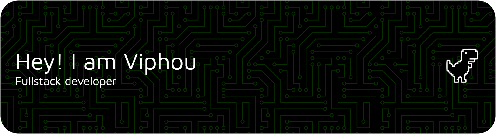

<!-- =======================================================
     VIPHOU SARUN — GITHUB PROFILE
     ======================================================= -->

 

# Hey! Nice to see you. 👋

I'm **Viphou**, a software engineer and product builder from 🇰🇭 Cambodia.

I enjoy turning ideas into useful products — from rental management software used by Cambodian landlords to AI-powered document systems.

Currently, I'm building **JoulHub**, exploring **AI / RAG systems**, and finishing my Software Engineering degree at CamTech University.

- 🏠 Building [**JoulHub**](https://www.joulhub.com) — rental management software for Cambodian landlords
- 🤖 Experimenting with **RAG, AI agents, and document intelligence**
- 🧑‍💻 Working across **full-stack web development & backend systems**
- 🧪 Usually building a side project or prototype somewhere

 

## Things I code with

  
  
  
  
  
  
  
  
  
  

 

## ✦ Selected work

<table>
<tr>
<td width="50%" valign="top">

### JoulHub

Rental management software built for Cambodian landlords — helping manage rooms, tenants, utilities, invoices, and payments in one place.

**TypeScript · Next.js · PostgreSQL**

[Website →](https://www.joulhub.com)

</td>
<td width="50%" valign="top">

### Document RAG

AI-powered document retrieval and Q&A system for searching and understanding internal documents, with a focus on Khmer-language workflows.

**Python · RAG · Vector Search · PostgreSQL**

[View project →](#)

</td>
</tr>

<tr>
<td width="50%" valign="top">

### Project 03

A full-stack product where I explored building a complete experience from frontend to backend.

**TypeScript · React · Node.js**

[View project →](#)

</td>
<td width="50%" valign="top">

### Project 04

An experimental project where I get to try new ideas, technologies, and things that look interesting.

**React · Python · Experiments**

[View project →](#)

</td>
</tr>
</table>

 

## A little about me

I like working somewhere between **engineering and product** — understanding a problem, building something, shipping it, and seeing whether people actually use it.

Outside of coding:

☕ I love coffee. I once opened an outdoor café. It lasted six months. 😅

🚀 I have a habit of turning random ideas into side projects.

🎮 I occasionally experiment with games, computer vision, 3D, and whatever technology catches my attention.

📚 I'm always learning something new — sometimes probably more things than I should.

 

## GitHub

 

## Where to find me

  
  
  

 

---

Always building something.
