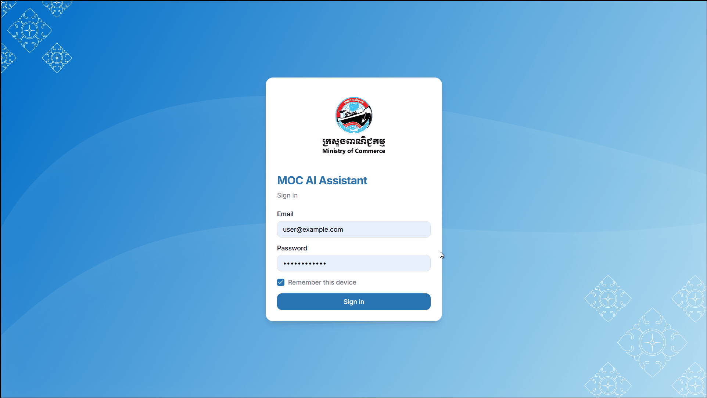

<!-- =======================================================
     VIPHOU SARUN — GITHUB PROFILE
     ======================================================= -->

  

 

# Hey! Nice to see you. 👋

I'm **Viphou**, a software engineer and product builder from 🇰🇭 Cambodia.

I enjoy building useful products, experimenting with AI, and working across the stack to turn ideas into things people can actually use.

Currently exploring **AI / RAG systems**, building side projects, contributing to production products, and finishing my Software Engineering degree.

- 🤖 Building and experimenting with **RAG, AI agents & document intelligence**
- 🧑‍💻 Working across **full-stack web development & backend systems**
- 🚀 Contributing to real products used in Cambodia
- 🧪 Usually have another side project running somewhere

 

## Things I code with

  
  
  
  
  
  
  
  
  
  

 

## ✦ Selected work

<table>
<tr>
<td width="50%" valign="top">

### 🔎 Document RAG

A document intelligence system I built for experimenting with retrieval, semantic search, and AI-powered Q&A over documents.

**Solo project**

`Python` `RAG` `Vector Search` `PostgreSQL`

[Live Demo →](https://rag-dev.rinviphou.com/)

</td>
<td width="50%" valign="top">

### 🎙️ Transcribe

A transcription tool I built to explore speech-to-text workflows and make converting audio into usable text simple.

**Solo project**

`AI` `Speech-to-Text` `Full Stack`

[Live Demo →](https://transcribe.rinviphou.com/)

</td>
</tr>

<tr>
<td width="50%" valign="top">

### 🇰🇭 CambodiaTrade

A national e-commerce marketplace connecting Cambodian businesses and products with local and international markets.

I contribute to the existing platform through **maintenance, feature development, debugging, and improvements**.

**Contributor / Maintainer**

`Laravel` `Vue` `MySQL`

[Visit CambodiaTrade →](https://cambodiatrade.com/)

</td>
<td width="50%" valign="top">

### 🏠 JoulHub

Rental management software designed for Cambodian landlords to manage properties, rooms, tenants, utilities, invoices, and payments.

I contribute to the product through **feature changes, improvements, and ongoing updates**.

**Product & Engineering Contributor**

`TypeScript` `Next.js` `PostgreSQL`

[Visit JoulHub →](https://joulhub.com/)

</td>
</tr>
</table>

 

## A little about me

I like working somewhere between **engineering and product** — understanding a problem, building something, shipping it, and seeing whether people actually use it.

Outside of coding:

☕ I love coffee. I once opened an outdoor café. It lasted six months. 😅

🚀 I have a habit of turning random ideas into side projects.

🎮 I occasionally experiment with games, computer vision, 3D, and whatever technology catches my attention.

📚 I'm always learning something new — sometimes probably more things than I should.

 

## GitHub

 

## Where to find me

  
  
  

 

---

Building useful things, one experiment at a time.
